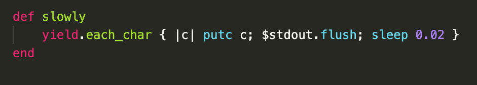
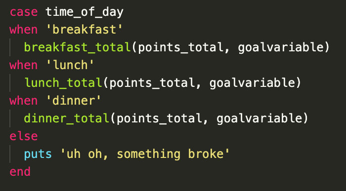
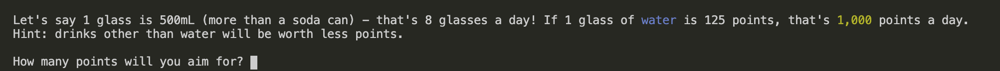
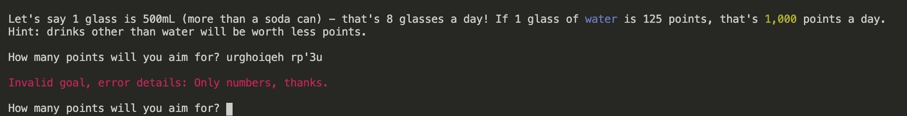
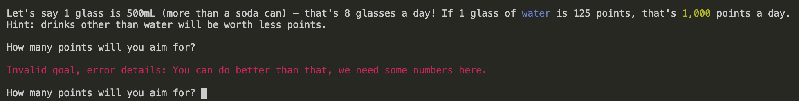
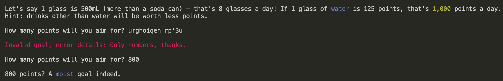
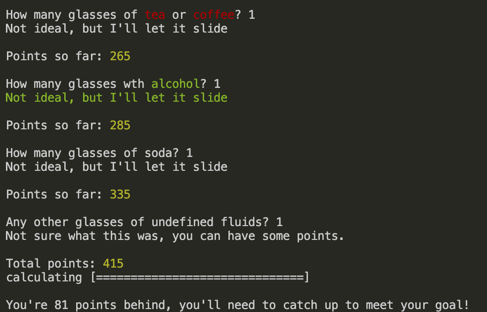

# Statement of Purpose and Scope

### Target audience:
This app is designed to help users who are at a desk most of the day (such as students and educators using online platforms) increase their water consumption throughout the day in a fun way.

### Why developed? 
Many people prefer caffeinated drinks or fail to move away from their desk and don’t drink enough water. Dehydration has negative impacts on most systems in the body and may even impact productivity, so increasing water consumption is in everyone’s best interest!

###Feature 1 - Readability:
The user interacts with the app through terminal, which can be difficult to track when everything is black and white and delivered in immediate, large chunks of text.
The app has colour incorporated throughout, for example red for errors, yellow for noteworthy information, and other colours for variety like blue for water related word.
The app also “types” output to the user (delivers words character by character) and has text-based art (e.g. Welcome banner) to enhance engagement.

###Feature 2 - Information gathering and validating:
The app requests multiple pieces of information from the user: their name, do they want to play, what is their point goal, what meal is it closest time to and how many glasses of specific drinks they have had. The app validates each of these inputs (not blank, numbers are always whole numbers/integers or specific words are typed) and provides error feedback to the user, before asking them to enter the input again.

###Feature 3 – Calculation and Evaluation:
The user’s inputs are used to calculate their points total. Each drink has a different points value and feedback message depending on the time of day. As the user inputs the amount/types of drinks they have had, the app generates a running total of points and displays appropriate feedback messages (e.g. caffeine at dinner time will wish you good luck sleeping). When all the inputs have been gathers the app compares the running points score to the goal set. If it is dinner time, the app will compare the score to the goal and evaluate if the user met the goal or not, with an appropriate message (e.g. congratulations or encouragement for next time with how many points missed). If it is breakfast or lunch, the app will compare the score to a percentage of the goal score and evaluate if the user is on track to meet their goal or not and display an appropriate message (e.g. on track or how many points behind).

##Features
###Feature 1 - Readability
The following gems were used to support this feature:
Artii was used to create the welcome screen and some of the final feedback.
TTY-progressbar was used to create the progress bar shown before the final points/goal evaluation.
Rainbow was used to change the colours of some output text.
The following code was used to return the output text character by character:
 
 

###Feature 2 - Information gathering and validating:
The app manages incorrect input in multiple ways.
When asking if the user wants to play, only “yes” and “no” are accepted, otherwise they are asked to enter again. This is achieved using a while loop and a case statement. The case statement breaks when “yes”, breaks and quits when “no” and loops with anything else.
Number and name validations are managed with error handling. If an empty input is entered (e.g. “   “ or just enter) the input is stripped, an error is raised (using validate_name/validate_num methods) and the user is asked to try again using retry/rescue within the first method. The same process is followed for letter and float/decimal inputs when only whole numbers are accepted.
Error handling also validates input for the time (breakfast, lunch or dinner) inputs but uses an “unless” statement to raise an error.
Once validated, inputs are stored as variables to be called later.

###Feature 3 – Calculation and Evaluation:
The app stores time-sensitive point values and feedback messages for drinks within classes. There is a Drink parent class with drink categories as child classes (e.g. Caffinated drinks). The variables stored from the user’s input determines which points/messages are accessed (e.g. entering “lunch” accesses global variables @lunchpoints and @lunchMessage).

Points and amounts of drinks are converted to integers (value.to_i) to execute basic mathematic functions, which vary based on the time entered. The correct functions are selected using a case statement:  

Then and If statement selects the appropriate math and feedback message. For example, if the goal is higher than the total points earned (if points_total < goalvariable) the app will  tell the user they did not meet their goal, and how many points they missed it by.

##User Interaction and Experience

###Feature 1 - Readability:
The user will simply have to run the app ($ ruby play_me.rb) and be presented with these features.

###Feature 2 - Information gathering and validating:
The user will be asked to enter specific information:  

Errors are reported and managed with the following example messages:
 

Correct input either get feedback (as below) or advances the program:
 
 
 
###Feature 3 – Calculation and Evaluation:
The app will progress through automatically when correct input is entered. Errors in this feature would be due to internal issues and should display the error message “Uh oh, something's gone wrong” although this has not been encountered in testing.
 

| Feaure  | What is it  | Expected outcome  |  Actual outcome |  Is it a problem? |
|---|---|---|---|---|
| Welcome image |  Artii image to welcome to game |  loads automatically |  loads automatically |  no |
|  User asked to play | app seeks yes or no input  | "yes" progresses, "no" quite, other input retries  |  as expected |  no |
| Validates input |  App asks name  |  App asks name, doesn't validate blank input |  as expected | no  |
|  Validates input |  App asks for goal | App asks goal, doesn't validate blank input, letters or floats |  as expected |  no |
|  Stores input |  goal validated then stored |  goal is returned in confirmation statement |  as expected | no  |
|  Generates points |  points correctly return and add |  breakfast - 1 glass of each 355 |  as expected |  no |
|  Generates points |  points correctly return and add |  lunch - 1 glass of each 412|  as expected | no  |
|  Points outcome feedback | points are evaluated against goal  | goal = 500, points = 355. 145 until goal  |  as expected | yes  |
|  Points outcome feedback | points are evaluated against goal  | goal = 500, points = 710. Goal beaten by 355  |  as expected | yes  |

